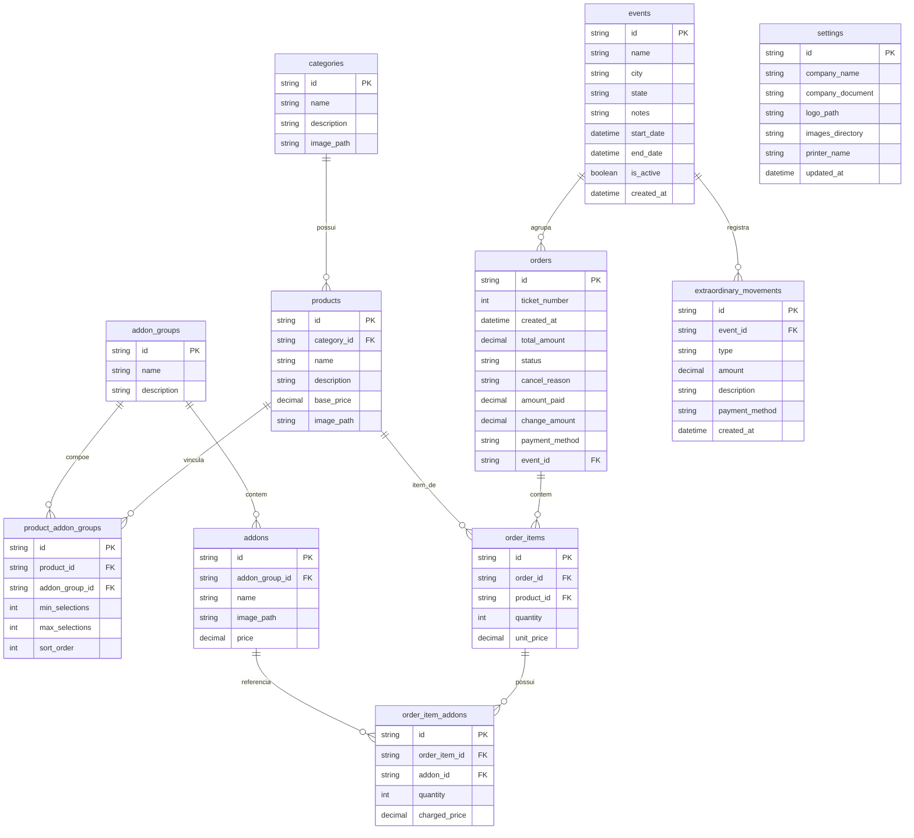

# Especificação de Arquitetura: Banco de Dados e Modelagem de Dados

**Status**: Aprovado  
**Versão**: 2.0.0  
**Contexto**: Modelagem Relacional, Persistência Local, Migrações Runtime e Transações  

---

## 1. Topologia e Armazenamento Físico

O **PDV Fácil** utiliza **SQLite 3** como mecanismo de banco de dados embutido, gerenciado pelo **Prisma ORM (v5.10.x)**.

### 1.1. Localização Física dos Arquivos
- **Ambiente de Desenvolvimento**: `prisma/dev.db`
- **Ambiente de Produção**: Armazenado de forma isolada e com permissões de usuário em:
  - **Windows**: `C:\Users\<Usuario>\AppData\Roaming\pdv-facil\pdv_database.sqlite`
  - **Linux**: `~/.config/pdv-facil/pdv_database.sqlite`

### 1.2. Inicialização e Bootstrap
No primeiro lançamento da aplicação:
1. O processo principal verifica a existência e tamanho do arquivo `pdv_database.sqlite` em `app.getPath('userData')`.
2. Se o arquivo não existir ou for menor que 20 KB (corrompido/incompleto), o template pré-configurado `prisma/dev.db` é copiado integralmente.
3. O `PRAGMA journal_mode = WAL;` (*Write-Ahead Logging*) é acionado imediatamente para garantir performance concorrente e resiliência contra quedas de energia.
4. O script `initializeDatabase()` em `src/main/database/prisma.ts` executa verificações incrementais de schema via SQL nativo para aplicar colunas e tabelas novas sem intervenção manual do usuário.

---

## 2. Diagrama Entidade-Relacionamento (ERD)



---

## 3. Dicionário Detalhado de Dados

### 3.1. `categories`
Armazena a categorização mercadológica do cardápio.
- `id` (`String`, UUID, PK): Identificador único.
- `name` (`String`): Nome exibido na interface e nas abas de filtros.
- `description` (`String?`): Descrição informativa.
- `image_path` (`String?`): Nome do arquivo da imagem WebP salva no diretório de mídia.

### 3.2. `products`
Itens comercializáveis do estabelecimento.
- `id` (`String`, UUID, PK): Identificador único.
- `category_id` (`String`, FK $\rightarrow$ `categories.id`): Categoria do produto.
- `name` (`String`): Nome do produto.
- `description` (`String?`): Detalhamento dos ingredientes ou composição.
- `base_price` (`Decimal`): Preço base cobrado pelo item sem adicionais.
- `image_path` (`String?`): Nome do arquivo da imagem WebP.

### 3.3. `addon_groups`
Agrupamentos de complementos opcionais ou obrigatórios.
- `id` (`String`, UUID, PK): Identificador único.
- `name` (`String`): Título do grupo (ex: "Molhos Especiais", "Ponto da Carne", "Bebidas").
- `description` (`String?`): Texto instrutivo para o operador.

### 3.4. `addons`
Complementos individuais vinculados a um grupo.
- `id` (`String`, UUID, PK): Identificador único.
- `addon_group_id` (`String`, FK $\rightarrow$ `addon_groups.id`): Grupo pai.
- `name` (`String`): Nome do complemento (ex: "Bacon Extra", "Cheddar Cremoso").
- `image_path` (`String?`): Imagem opcional do item.
- `price` (`Decimal`): Custo adicional unitário a somar no item (pode ser 0.00).

### 3.5. `product_addon_groups`
Tabela pivô com metadados de regras de seleção entre produtos e grupos.
- `id` (`String`, UUID, PK): Identificador único da relação.
- `product_id` (`String`, FK $\rightarrow$ `products.id`): Produto alvo.
- `addon_group_id` (`String`, FK $\rightarrow$ `addon_groups.id`): Grupo vinculado.
- `min_selections` (`Int`, default 0): Quantidade mínima exigida para avançar.
- `max_selections` (`Int`): Quantidade máxima de seleções somadas permitidas no grupo.
- `sort_order` (`Int`, default 0): Ordenação visual dos grupos no modal de vendas.

### 3.6. `events`
Praças e eventos temporários para controle itinerante de vendas.
- `id` (`String`, UUID, PK): Identificador único.
- `name` (`String`): Nome fantasia do evento (ex.: "Festival de Inverno 2026").
- `city` (`String`): Município onde ocorre a operação.
- `state` (`String?`, default "SP"): UF federativa.
- `notes` (`String?`): Observações operacionais.
- `start_date` (`DateTime`): Timestamp de início da operação.
- `end_date` (`DateTime`): Timestamp de término da operação.
- `is_active` (`Boolean`, default true): Flag para soft-delete e controle de status.
- `created_at` (`DateTime`): Data de registro no sistema.

### 3.7. `extraordinary_movements`
Entradas e saídas financeiras avulsas no caixa do evento.
- `id` (`String`, UUID, PK): Identificador único.
- `event_id` (`String`, FK $\rightarrow$ `events.id`, CASCADE): Evento ao qual o lançamento pertence.
- `type` (`String`): Tipo de movimentação (`"entrada"` ou `"saida"`).
- `amount` (`Decimal`): Valor monetário do lançamento.
- `description` (`String`): Descrição do motivo (ex.: "Suprimento de Moedas", "Gelo").
- `payment_method` (`String?`): Método de transação (Dinheiro, PIX, etc.).
- `created_at` (`DateTime`): Timestamp do registro.

### 3.8. `orders`
Pedidos consolidados emitidos no caixa.
- `id` (`String`, UUID, PK): Identificador único.
- `ticket_number` (`Int`): Senha diária de atendimento sequencial.
- `created_at` (`DateTime`): Data e hora exata da emissão.
- `total_amount` (`Decimal`): Valor total recalculado pelo backend.
- `status` (`String`, default "Pago"): `"Pago"` ou `"Cancelado"`.
- `cancel_reason` (`String?`): Justificativa obrigatória caso cancelado.
- `amount_paid` (`Decimal?`): Valor recebido em espécie pelo cliente.
- `change_amount` (`Decimal?`): Troco devolvido ao cliente.
- `payment_method` (`String?`): Método utilizado (Dinheiro, Crédito, Débito, PIX).
- `event_id` (`String?`, FK $\rightarrow$ `events.id`): Evento associado no momento da venda ou retroativamente.

### 3.9. `order_items`
Itens que compõem o pedido emitido.
- `id` (`String`, UUID, PK): Identificador único.
- `order_id` (`String`, FK $\rightarrow$ `orders.id`): Pedido associado.
- `product_id` (`String`, FK $\rightarrow$ `products.id`): Produto vendido.
- `quantity` (`Int`): Quantidade adquirida.
- `unit_price` (`Decimal`): Preço unitário base do produto congelado no momento da venda.

### 3.10. `order_item_addons`
Adicionais associados a um item específico do pedido.
- `id` (`String`, UUID, PK): Identificador único.
- `order_item_id` (`String`, FK $\rightarrow$ `order_items.id`): Item de pedido pai.
- `addon_id` (`String`, FK $\rightarrow$ `addons.id`): Adicional selecionado.
- `quantity` (`Int`): Quantidade daquele adicional adicionado à unidade do produto.
- `charged_price` (`Decimal`): Preço unitário do adicional congelado no momento da venda.

### 3.11. `settings`
Tabela singleton para parametrização do software.
- `id` (`String`, UUID, PK): Chave primária.
- `company_name` (`String?`): Razão social ou nome fantasia do estabelecimento.
- `company_document` (`String?`): CNPJ ou CPF formatado.
- `logo_path` (`String?`): Nome do arquivo da logomarca WebP.
- `images_directory` (`String?`): Caminho customizado absoluto para armazenamento de fotos.
- `printer_name` (`String?`): Nome da impressora térmica padrão para emissão silenciosa.
- `updated_at` (`DateTime`): Timestamp da última alteração.

---

## 4. Garantias Transacionais e Integridade

Operações que tocam múltiplas tabelas utilizam obrigatoriamente `prisma.$transaction`:

```typescript
// Criação atômica de pedido
return prisma.$transaction(async (tx) => {
  // 1. Determina próximo ticket_number do dia com trava de concorrência
  // 2. PricingService valida e busca preços reais das tabelas products e addons
  // 3. Cria order, order_items e order_item_addons em única transação ACID
  // 4. Se qualquer item falhar, toda a operação é revertida
});
```
