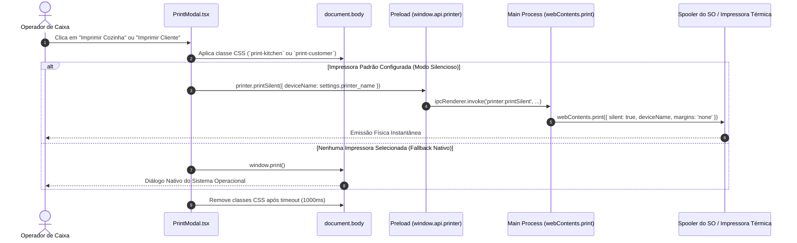

# Especificação de Arquitetura: Hardware e Impressão Térmica

**Status**: Aprovado  
**Versão**: 2.0.0  
**Contexto**: Integração com Spoolers de Impressão, Formatação 80mm e Layouts Térmicos  

---

## 1. Visão Geral da Arquitetura de Impressão

O **PDV Fácil** integra suporte nativo para impressoras térmicas de cupom não-fiscal (largura padrão de **80mm**), atendendo a ambientes de alta rotatividade que exigem emissão instantânea sem interrupções por caixas de diálogo do sistema operacional.



---

## 2. Métodos de Impressão e Comunicação IPC

### 2.1. Descoberta de Dispositivos Conectados
O sistema lista as impressoras instaladas no sistema operacional através do método assíncrono do Electron:
- **Canal IPC**: `printer:getPrinters`
- **Implementação**:
  ```typescript
  ipcMain.handle('printer:getPrinters', async (event) => {
    return await event.sender.getPrintersAsync();
  });
  ```
- **Retorno**: Coleção de objetos contendo `name`, `displayName`, `isDefault`, `status`.

### 2.2. Impressão Silenciosa (*Silent Print*)
Permite disparar a impressão de forma direta e assíncrona sem exibir o assistente do Windows/Linux:
- **Canal IPC**: `printer:printSilent`
- **Parâmetros**: `{ deviceName: string }`
- **Implementação**:
  ```typescript
  ipcMain.handle('printer:printSilent', async (event, options) => {
    try {
      event.sender.print({
        silent: true,
        deviceName: options.deviceName,
        margins: { marginType: 'none' }
      });
      return { success: true };
    } catch (e: any) {
      logger.error('Erro na impressão silenciosa:', e);
      return { success: false, error: e.message };
    }
  });
  ```

---

## 3. Arquitetura do Componente `PrintableReceipt`

O componente `PrintableReceipt.tsx` fica persistentemente montado na raiz do documento via React Portal (`createPortal(..., document.body)`).

### 3.1. Visibilidade e Ocultamento
- Em tela normal (`screen`), o elemento `.print-receipt` possui `display: none;`.
- Durante a impressão (`@media print`), a aplicação inteira (`#root`) é forçada a `display: none !important;`, tornando visível unicamente o wrapper `.print-wrapper`.

### 3.2. Formatação CSS para Bobina de 80mm
As regras contidas em `src/renderer/index.css` garantem precisão milimétrica para bobinas térmicas:

```css
@media print {
  @page {
    margin: 0;
  }

  html, body {
    margin: 0 !important;
    padding: 0 !important;
    height: auto !important;
    min-height: 0 !important;
  }

  /* Oculta interface do sistema */
  #root {
    display: none !important;
  }

  /* Largura fixa da bobina térmica */
  .print-wrapper {
    width: 80mm;
    margin: 0;
    padding: 0;
    overflow: hidden;
  }

  .print-receipt {
    display: block !important;
    width: 100%;
    margin: 0;
    padding: 0 4mm 0 5mm; /* Margens de segurança contra cortes de guilhotina */
    background: white;
    font-family: monospace;
  }
}
```

---

## 4. Especificação dos Layouts de Impressão

A alternância entre os tipos de comprovante ocorre mediante a injeção dinâmica de classes CSS no elemento `<body>`:

### 4.1. Layout do Cliente (`body.print-customer`)
Focado na clareza fiscal auxiliar e detalhamento financeiro da compra.
- **Cabeçalho**:
  - Razão Social / Nome da Empresa (`settings.company_name`).
  - CNPJ / CPF formatado (`settings.company_document`).
  - Identificação do Evento e Município (se houver evento ativo associado).
  - Texto obrigatório: *"Documento Auxiliar de Venda — NÃO É DOCUMENTO FISCAL"*.
  - Data e Hora da Emissão formatada em `pt-BR`.
- **Identificação do Pedido**:
  - Título *"SENHA DE ATENDIMENTO"*.
  - Número do Ticket em tamanho 48px (`orderData.ticketNumber`).
- **Detalhamento de Itens**:
  - Lista: `[Quantidade]x [Nome do Produto] .......... R$ [Total do Item]`.
  - Adicionais: `+ [Qtd]x [Nome do Adicional] ...... R$ [Valor Cobrado]`.
- **Rodapé Financeiro**:
  - Total Geral da Venda.
  - Forma de Pagamento Utilizada.
  - Se em Dinheiro: *Dinheiro Recebido* e *Troco*.
  - Mensagem de encerramento: *"Obrigado e volte sempre!"*.

### 4.2. Layout da Cozinha (`body.print-kitchen`)
Focado em agilidade operacional, legibilidade visual à distância e redução do gasto de papel térmico.
- **Supressões Críticas**:
  - Todos os dados financeiros (preços unitários, subtotal e troco) são suprimidos (`.print-hide-kitchen`).
  - Cabeçalho institucional da empresa é ocultado.
- **Destaques Operacionais**:
  - Aumento da tipografia para **14pt a 18pt** em negrito (`font-weight: 900`).
  - Senha exibida com prefixo inline: `Senha 123`.
  - Divisores pontilhados fortes (`border-bottom: 2px dashed black`) entre cada item para permitir que a equipe de cozinha separe comandas facilmente.
  - Adicionais e quantidades multiplicadas destacados com recuo visual (`pl-4 mt-1 font-bold`).
