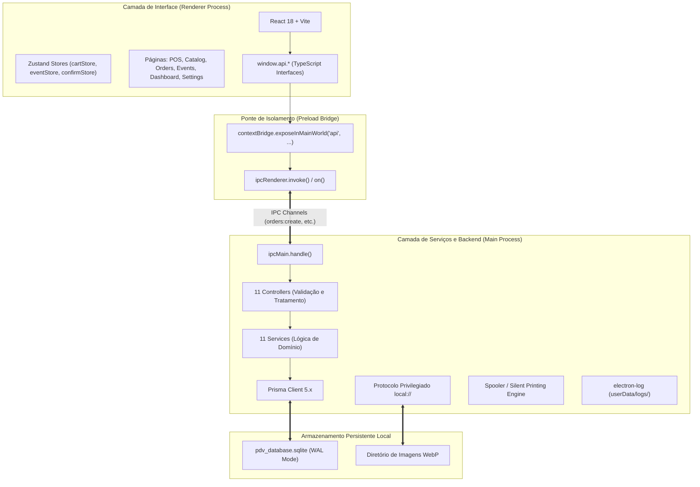

# Especificação de Arquitetura: Visão Geral do Sistema

**Status**: Aprovado  
**Versão**: 2.0.0  
**Contexto**: Arquitetura Fundamental / Processos Electron e Comunicação IPC  

---

## 1. Visão Executiva e Filosofia Arquitetural

O **PDV Fácil** é um sistema de Ponto de Venda (PDV) desktop projetado sob o paradigma **Offline-First**. 

### 1.1. Princípios Arquiteturais Centrais
1. **Zero Dependência de Rede para Operação Crítica**: Todas as rotinas essenciais (catálogo, emissão de vendas, controle de troco, histórico, métricas e impressão térmica) operam sem conexão à internet.
2. **Isolamento e Segurança Estrita no Electron**: Segregação de responsabilidades sem vazamento de módulos de baixo nível (`fs`, `child_process`, `electron`) para a camada de visualização.
3. **Integridade Financeira Server-Side**: O frontend é tratado como interface não-confiável para cálculos de preço. O backend local recalcula e valida todos os totais em transações atômicas.
4. **Resiliência a Quedas de Energia**: Utilização de SQLite em modo WAL (*Write-Ahead Logging*) com sincronização de disco para proteger registros contra falhas de fornecimento elétrico repentinas.

---

## 2. Topologia de Processos do Electron

A aplicação é dividida em três camadas isoladas e com fronteiras bem definidas:



### 2.1. Renderer Process (`src/renderer/`)
- **Tecnologias**: React 18, Vite 5, TailwindCSS 3.4, React Router DOM 7 (`HashRouter`), Recharts 3, Lucide React, Sonner.
- **Isolamento**: Não tem acesso direto ao Node.js (`nodeIntegration: false`). Comunica-se exclusivamente através do objeto tipado global `window.api`.
- **Roteamento**: Opera em `HashRouter` para evitar problemas de resolução de arquivos estáticos empacotados em ambientes Windows/Linux.

### 2.2. Preload Bridge (`src/preload/index.ts`)
- Utiliza `contextBridge.exposeInMainWorld('api', { ... })`.
- Agrupa APIs em namespaces de domínio (`app`, `categories`, `products`, `addonGroups`, `addons`, `productAddonGroups`, `orders`, `dashboard`, `events`, `extraordinaryMovements`, `settings`, `printer`, `dialog`, `image`, `updater`).
- Nunca expõe diretamente a instância do `ipcRenderer` ao Renderer.

### 2.3. Main Process (`src/main/`)
- **Tecnologias**: Node.js, Electron 29, Prisma Client 5, Sharp, electron-log.
- **Padrão Controller / Service**:
  - **Controllers**: Recebem a chamada IPC, desembalam parâmetros, tratam exceções e retornam respostas padronizadas `ApiResponse<T>`.
  - **Services**: Implementam as regras de negócio puras e manipulação direta do banco via Prisma. Não conhecem eventos de IPC.

---

## 3. Padrão de Comunicação IPC

### 3.1. DTO Padronizado de Resposta
Todas as invocações IPC retornam a seguinte estrutura de dados:

```typescript
export interface ApiResponse<T = any> {
  success: boolean;
  data?: T;
  error?: string;
}
```

### 3.2. Fluxo Bidirecional de Requisição
1. **Frontend**: Invoca `const res = await window.api.orders.create(payload)`.
2. **Preload**: Mapeia para `ipcRenderer.invoke('orders:create', payload)`.
3. **Main (Handler)**: `ipcMain.handle('orders:create', OrdersController.create)`.
4. **Controller**: Executa `OrdersService.create(payload)`.
5. **Serialização Limpa**: Os objetos do Prisma passam por serialização segura para remover referências circulares ou tipos não suportados pelo IPC do Electron antes de retornar:
   ```typescript
   return { success: true, data: JSON.parse(JSON.stringify(result)) };
   ```

---

## 4. Segurança e Hardening do Electron

1. **`contextIsolation: true`**: Garante que o script de preload e o código do React rodem em contextos de execução separados, prevenindo prototype pollution.
2. **`nodeIntegration: false`**: Impede que scripts do frontend executem comandos de sistema ou leiam o disco.
3. **Bloqueio de Novas Janelas**:
   ```typescript
   mainWindow.webContents.setWindowOpenHandler(() => {
     return { action: 'deny' };
   });
   ```
4. **Remoção de Menu Padrão em Produção**:
   ```typescript
   if (app.isPackaged) {
     mainWindow.setMenu(null);
   }
   ```
5. **Proteção de Path Traversal no Protocolo `local://`**:
   O manipulador de imagens valida estritamente se o caminho do arquivo resultante reside dentro do diretório de imagens permitido antes de emitir qualquer resposta.

---

## 5. Observabilidade e Logging Persistente

O sistema emprega `electron-log` para registrar eventos operacionais e erros de runtime:
- **Caminho dos Arquivos**: `%APPDATA%/pdv-facil/logs/` (Windows) ou `~/.config/pdv-facil/logs/` (Linux).
- **Rotação**: Automática a cada 5 MB por arquivo.
- **Formato**: `[YYYY-MM-DD HH:mm:ss.ms] [level] message`.
- **Eventos Monitorados**: Inicialização de banco de dados, conexão SQLite, emissão/cancelamento de pedidos, falhas de I/O de imagens, erros de impressão e download de atualizações.
