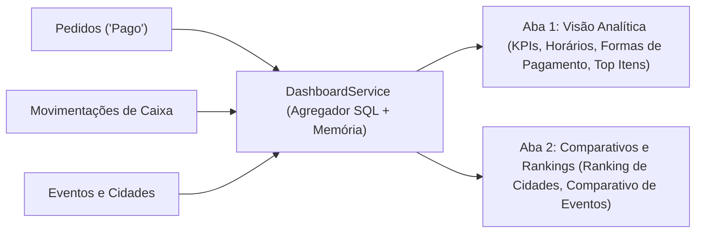

# Especificação de Domínio: Dashboard Analítico, Métricas e Rankings

**Status**: Aprovado  
**Versão**: 2.0.0  
**Contexto**: Inteligência de Negócio, Agregação de Vendas, Comparativos Regionais e Gráficos  

---

## 1. Visão Geral do Domínio

O domínio de **Analytics e Dashboard** consolida dados de vendas e movimentações de caixa em tempo real para permitir decisões estratégicas imediatas. A arquitetura suporta tanto a visão operacional diária de caixa quanto a análise comparativa entre eventos e municípios itinerantes.

---

## 2. Aba 1: Visão Analítica (`GeneralTab`)

Focada no acompanhamento operacional de vendas com filtros dinâmicos e responsivos.

### 2.1. Filtros Multidimensionais
1. **Período Temporal**:
   - `Hoje`: `00:00:00` às `23:59:59` da data corrente.
   - `Ontem`: Intervalo completo do dia anterior.
   - `Últimos 7 dias`: Janela retroativa de 7 dias a partir de hoje.
   - `Este Mês`: Do primeiro ao último dia do mês corrente.
   - `Todo o Período`: Todo o histórico registrado no banco.
   - `Personalizado`: Seleção de intervalo livre com `react-datepicker`.
2. **Filtros Cruzados Secundários**:
   - **Forma de Pagamento**: Dinheiro, Cartão de Crédito, Cartão de Débito, PIX.
   - **Evento Específico**: Filtra exclusivamente vendas e movimentações atreladas àquele evento.
   - **Cidade Específica**: Filtra todas as operações ocorridas naquele município.

### 2.2. Cards de Métricas Principais (KPIs)
- **Faturamento Total Líquido**:
  $$\text{Receita} = \sum_{\text{pedidos válidos}} \text{total\_amount} + \sum_{\text{entradas}} \text{amount} - \sum_{\text{saídas}} \text{amount}$$
  *(Pedidos com status `'Cancelado'` são estritamente excluídos).*
- **Total de Pedidos**: Quantidade absoluta de pedidos válidos emitidos.
- **Ticket Médio**: $\frac{\text{Faturamento Total}}{\text{Total de Pedidos}}$ (retorna `0.00` se não houver pedidos).

### 2.3. Agrupamento Temporal Adaptativo de Faturamento (`getChartData`)
O gráfico de evolução temporal do faturamento ajusta automaticamente sua granularidade com base no tamanho do intervalo consultado:

$$\Delta t = \frac{\text{Data Fim} - \text{Data Início}}{1000 \times 60 \times 60} \quad (\text{horas})$$

- **Se $\Delta t \le 72$ horas**: Agrupamento por **Hora** com chave no formato `DD/MM HH:00`.
- **Se $\Delta t > 72$ horas**: Agrupamento por **Dia** com chave no formato `DD/MM`.

As movimentações de caixa extraordinárias ocorridas no período são integradas proporcionalmente à sua respectiva faixa de hora/dia.

### 2.4. Gráficos de Apoio
- **Vendas por Forma de Pagamento**: Gráfico de pizza/barras com total monetário e contagem de transações por método.
- **Top 5 Itens Mais Vendidos**: Agregação `groupBy(product_id)` somando `quantity` em ordem decrescente, com enriquecimento do nome do produto.

---

## 3. Aba 2: Comparativos e Rankings (`ComparisonsTab`)

Projetada para avaliar a rentabilidade relativa entre diferentes cidades e eventos realizados.

### 3.1. Ranking de Cidades (`getCityRanking`)
Gera a tabela consolidada de desempenho por praça:
- **Faturamento Acumulado**: Vendas líquidas geradas em eventos daquela cidade.
- **Total de Pedidos**: Volume de atendimento.
- **Total de Eventos Realizados**: Número de praças promovidas na localidade.
- **Ticket Médio da Cidade**: $\frac{\text{Faturamento da Cidade}}{\text{Total de Pedidos da Cidade}}$.

### 3.2. Comparativo de Eventos (`getEventComparison`)
Compara lado a lado o desempenho financeiro de cada evento cadastrado:
- Nome do Evento e Cidade.
- Período de Realização (`start_date` até `end_date`).
- Receita Líquida Total e Quantidade de Pedidos.
- Ordenação decrescente por maior receita gerada.

### 3.3. Evolução Temporal Comparativa por Cidade (`getCityRevenueOverTime`)
Gráfico de múltiplas linhas onde o eixo X representa a linha do tempo (`date`) e cada cidade atendida gera uma curva independente, permitindo comparar o ritmo de vendas em diferentes praças simultâneas ou consecutivas.

---

## 4. Especificação dos Canais IPC

| Canal IPC | Parâmetros | Retorno (`ApiResponse<T>`) | Descrição |
|---|---|---|---|
| `dashboard:getMetrics` | `filters?: MetricsFilter` | `{ totalRevenue, totalOrders, averageTicket }` | KPIs centrais consolidados |
| `dashboard:getTopItems` | `filters?: MetricsFilter` | `Array<{ productName, quantity }>` | 5 produtos mais vendidos |
| `dashboard:getChartData` | `filters?: MetricsFilter` | `Array<{ name: string, total: number }>` | Série temporal com agrupamento inteligente |
| `dashboard:getSalesByPaymentMethod` | `filters?: MetricsFilter` | `Array<{ method, total, count }>` | Distribuição por método de pagamento |
| `dashboard:getEventMetrics` | `eventId: string` | `EventMetricsDTO` | Métricas dedicadas de um evento específico |
| `dashboard:getCityComparison` | `filters?: DateFilter` | `CityComparisonDTO[]` | Comparativo consolidado entre cidades |
| `dashboard:getEventComparison` | `filters?: DateFilter` | `EventComparisonDTO[]` | Desempenho relativo entre eventos |
| `dashboard:getEventTopItems` | `eventId: string` | `Array<{ productName, quantity }>` | Top itens de um evento específico |
| `dashboard:getCityRevenueOverTime` | `filters?: DateFilter` | `Array<{ date, [city]: number }>` | Série temporal multi-cidade para Recharts |
| `dashboard:getEventPaymentMethods` | `eventId: string` | `Array<{ method, total, count }>` | Métodos de pagamento de um evento |
| `dashboard:getCityRanking` | `filters?: DateFilter` | `CityRankingDTO[]` | Ranking de praças municipais |
