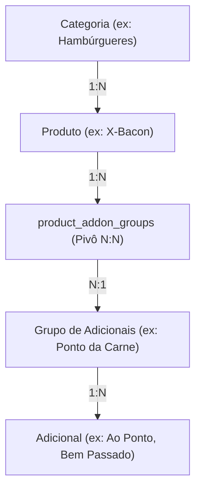
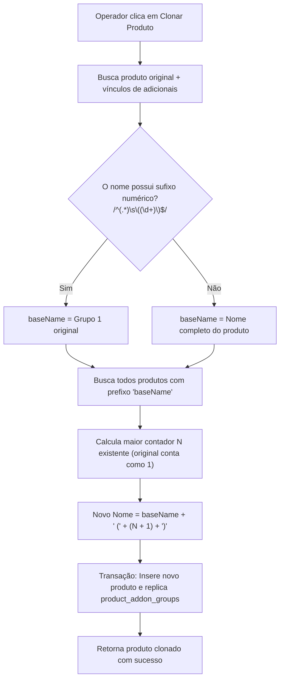

# Especificação de Domínio: Gestão de Catálogo e Produtos

**Status**: Aprovado  
**Versão**: 2.0.0  
**Contexto**: Módulo de Cardápio, Categorias, Complementos, Clonagem e Interações UX  

---

## 1. Visão Geral do Domínio

O domínio de **Catálogo** é responsável pela estruturação do cardápio comercializável do estabelecimento. Ele organiza produtos em categorias e oferece flexibilidade para composição de complementos (adicionais) com restrições quantitativas e ordenação.

---

## 2. Modelagem e Regras de Negócio

### 2.1. Categorias (`categories`)
- Representam os grupos macro do cardápio exibidos como filtros tipo pílula no PDV.
- Operações: Listar (`getAll`), Buscar (`getById`), Criar (`create`), Editar (`update`), Excluir (`delete`).
- Uma categoria excluída não pode excluir em cascata produtos com histórico de vendas (protegida por integridade relacional).

### 2.2. Grupos de Adicionais (`addon_groups`) e Itens (`addons`)
- Grupos são coleções conceituais de complementos (ex.: "Bebidas", "Molhos", "Ingredientes Extras").
- Cada item adicional possui um preço próprio (`price: Decimal`), que pode ser `0.00` (opção de preparo) ou valor positivo.
- Adicionais são gerenciados hierarquicamente dentro do seu respectivo grupo.

### 2.3. Vínculo Produto $\leftrightarrow$ Grupos (`product_addon_groups`)
A mesma coleção de adicionais (ex.: "Refrigerantes em Lata") pode ser associada a múltiplos produtos, mas cada associação possui regras customizadas:
- `min_selections`: Mínimo de escolhas obrigatórias no grupo (se `min > 0`, o grupo é obrigatório no POS).
- `max_selections`: Limite máximo de adições no grupo (soma das quantidades selecionadas).
- `sort_order`: Posição ordinal de apresentação no modal de montagem de item.

---

## 3. Algoritmo Inteligente de Clonagem de Produto

Para acelerar o cadastro de variações (ex.: criar "X-Salada Duplo" a partir de "X-Salada"), o sistema disponibiliza o recurso de clonagem profunda via `products:clone`.

### 3.1. Exemplos de Comportamento do Algoritmo

| Produto Original | Produtos já Existentes no Banco | Nome Atribuído ao Novo Clone |
|---|---|---|
| `Suco de Laranja` | `Suco de Laranja` | `Suco de Laranja (2)` |
| `Suco de Laranja (2)` | `Suco de Laranja`, `Suco de Laranja (2)` | `Suco de Laranja (3)` |
| `Suco de Laranja` | `Suco de Laranja`, `Suco de Laranja (2)`, `Suco de Laranja (4)` | `Suco de Laranja (5)` |

### 3.2. Propriedades Replicadas
- Categoria (`category_id`)
- Imagem associada (`image_path`)
- Descrição (`description`)
- Preço base (`base_price`)
- Todos os registros associados em `product_addon_groups` com seus respectivos `min_selections`, `max_selections` e `sort_order`.

---

## 4. Padrões de Interação e Experiência do Usuário (UX)

### 4.1. Click-to-Edit
Elimina a poluição visual de ícones de lápis em todas as tabelas do catálogo (`ProductList`, `CategoryList`, `AddonGroupList`):
- O clique em qualquer célula da linha (`<tr>`) redireciona imediatamente para a tela de edição do registro (`navigate('/products/:id')`).
- Linhas possuem efeito visual de hover com destaque de fundo (`hover:bg-blue-50/40`) e texto em cor de destaque (`group-hover:text-blue-700`).
- **Isolamento de Ações**: Botões de exclusão (🗑) e clonagem (🗐) disparam `e.stopPropagation()` para evitar que o clique na ação ative a navegação da linha.

### 4.2. Formatação Monetária
Entradas numéricas financeiras utilizam o componente `CurrencyInput` com máscara monetária em Real (`R$ 0,00`), garantindo que o operador nunca envie valores corrompidos por vírgulas e pontos incorretos.

---

## 5. Especificação dos Canais IPC

| Canal IPC | Parâmetros | Retorno (`ApiResponse<T>`) | Descrição |
|---|---|---|---|
| `categories:getAll` | — | `Category[]` | Lista todas as categorias |
| `categories:getById` | `id: string` | `Category` | Obtém categoria específica |
| `categories:create` | `{ name, description, image_path }` | `Category` | Cria nova categoria |
| `categories:update` | `id: string, data` | `Category` | Atualiza categoria |
| `categories:delete` | `id: string` | `{ id: string }` | Exclui categoria |
| `products:getAll` | — | `Product[]` | Lista todos os produtos com categoria |
| `products:getMenu` | — | `Product[]` | Lista cardápio com grupos de adicionais |
| `products:getById` | `id: string` | `Product` | Detalhes do produto |
| `products:create` | `{ name, description, base_price, category_id, image_path }` | `Product` | Cria novo produto |
| `products:update` | `id: string, data` | `Product` | Atualiza produto |
| `products:delete` | `id: string` | `{ id: string }` | Exclui produto |
| `products:clone` | `id: string` | `Product` | Clona produto e replica adicionais |
| `addonGroups:getAll` | — | `AddonGroup[]` | Lista grupos com contagem de adicionais |
| `addonGroups:getById` | `id: string` | `AddonGroup` | Detalhes do grupo e seus adicionais |
| `addonGroups:create` | `{ name, description }` | `AddonGroup` | Cria grupo |
| `addonGroups:update` | `id: string, data` | `AddonGroup` | Atualiza grupo |
| `addonGroups:delete` | `id: string` | `{ id: string }` | Exclui grupo |
| `addons:getAll` | `groupId: string` | `Addon[]` | Lista adicionais de um grupo |
| `addons:create` | `{ addon_group_id, name, price, image_path }` | `Addon` | Cria item adicional |
| `addons:update` | `id: string, data` | `Addon` | Atualiza adicional |
| `addons:delete` | `id: string` | `{ id: string }` | Exclui adicional |
| `productAddonGroups:getByProductId` | `productId: string` | `ProductAddonGroup[]` | Lista vínculos de um produto |
| `productAddonGroups:saveLinks` | `productId: string, links: any[]` | `void` | Substitui atomicamente todos os vínculos |
