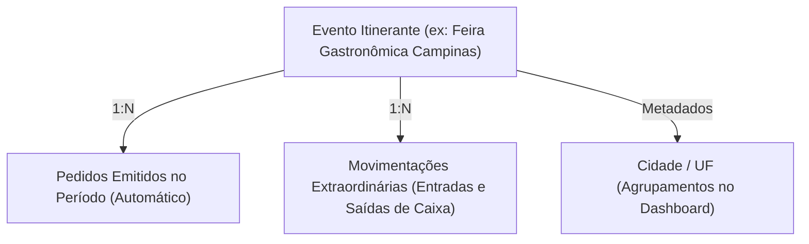
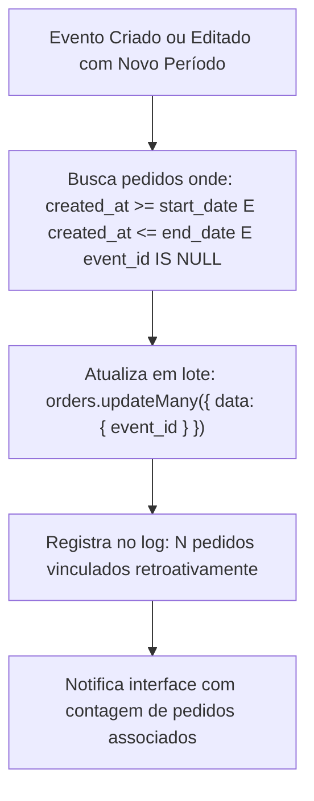

# Especificação de Domínio: Gestão de Eventos, Cidades e Movimentações de Caixa

**Status**: Aprovado  
**Versão**: 2.0.0  
**Contexto**: Operações Itinerantes, Calendário, Vínculo Retroativo e Fluxo de Caixa Extraordinário  

---

## 1. Visão Geral do Domínio

O domínio de **Eventos e Cidades** atende à natureza itinerante de comércios que operam em praças rotativas, food trucks, eventos corporativos e festivais gastronômicos. Ele possibilita segregar faturamentos, tickets médios e mix de produtos por praça, garantindo precisão contábil mesmo quando eventos são cadastrados após o início das vendas.



---

## 2. Ciclo de Vida do Evento

### 2.1. Criação e Agendamento
- Um evento possui `name`, `city`, `state`, `start_date`, `end_date` e `notes`.
- **Validação de Cronologia**: `end_date` deve ser estritamente posterior a `start_date`.

### 2.2. Algoritmo de Prevenção de Conflito de Período (*Overlap Check*)
O sistema impede que dois eventos fiquem ativos no mesmo intervalo temporal, evitando ambiguidade na atribuição de pedidos.

Dois intervalos $[A_{\text{start}}, A_{\text{end}}]$ e $[B_{\text{start}}, B_{\text{end}}]$ conflitam se, e somente se:
$$A_{\text{start}} < B_{\text{end}} \quad \text{e} \quad B_{\text{start}} < A_{\text{end}}$$

Implementação em `EventService.ts`:
```typescript
async checkOverlap(startDate: Date, endDate: Date, excludeId?: string) {
  const overlapping = await prisma.events.findFirst({
    where: {
      is_active: true,
      ...(excludeId ? { id: { not: excludeId } } : {}),
      start_date: { lt: endDate },
      end_date: { gt: startDate }
    }
  });

  if (overlapping) {
    throw new Error(
      `Este período conflita com o evento "${overlapping.name}" (${overlapping.city}), ` +
      `que vai de ${overlapping.start_date.toLocaleDateString('pt-BR')} até ${overlapping.end_date.toLocaleDateString('pt-BR')}.`
    );
  }
}
```

---

## 3. Vínculo Retroativo Automático de Pedidos

Um dos maiores desafios em operações de campo é o operador começar a vender antes de cadastrar o evento no sistema. Para resolver isso de forma transparente, o **PDV Fácil** implementa **associação retroativa de vendas**.



- Se o evento for atualizado com novas datas, os pedidos anteriormente vinculados são desvinculados e a re-associação é executada baseada no novo intervalo.
- Pedidos que já pertencem a outro evento não são sobrescritos.

---

## 4. Detecção e Encerramento de Evento Ativo

### 4.1. Evento Ativo no Momento (`events:getActive`)
O sistema identifica o evento ativo em tempo de execução consultando:
$$\text{start\_date} \le \text{now} \le \text{end\_date} \quad \text{e} \quad \text{is\_active} = \text{true}$$

Quando existe um evento ativo:
- O PDV (`POSPage`) e o `CartSidebar` injetam automaticamente o `eventId` nas novas vendas emitidas.
- Os comprovantes de impressão térmicos incluem o badge visual do evento e a cidade no cabeçalho.

### 4.2. Encerramento Antecipado (`events:endActive`)
Caso um evento termine antes do horário previsto na programação:
- O método ajusta `end_date = now - 1 segundo`.
- Assegura que vendas emitidas a partir deste instante não recebam mais a tag do evento encerrado.

### 4.3. Exclusão Segura (*Soft-Delete*)
Ao excluir um evento (`events:delete`):
- O evento recebe `is_active = false`.
- Todos os pedidos vinculados têm seu `event_id` revertido para `null`, preservando as vendas intactas no histórico global.

---

## 5. Movimentações Extraordinárias de Caixa (`extraordinary_movements`)

Em operações itinerantes, despesas operacionais em dinheiro ocorrem com frequência no próprio caixa físico. As movimentações extraordinárias permitem manter a exatidão financeira entre o saldo físico da gaveta e o faturamento contábil.

### 5.1. Tipos de Movimentação
1. **Entrada (`type: 'entrada'`)**: Suprimento de troco inicial, injeção de dinheiro no caixa pelo proprietário.
2. **Saída (`type: 'saida'`)**: Pagamento de taxa de espaço, compra de gelo, suprimentos de emergência, despesas de combustível.

### 5.2. Impacto no Faturamento do Evento
O cálculo de faturamento do evento computa o resultado líquido real:
$$\text{Faturamento Líquido} = \text{Receita de Vendas} + \sum \text{Entradas Extraordinárias} - \sum \text{Saídas Extraordinárias}$$

---

## 6. Especificação dos Canais IPC

| Canal IPC | Parâmetros | Retorno (`ApiResponse<T>`) | Descrição |
|---|---|---|---|
| `events:getAll` | — | `Event[]` | Lista eventos ativos ordenados por data desc |
| `events:getById` | `id: string` | `Event` | Detalhes do evento |
| `events:create` | `{ name, city, state, notes, start_date, end_date }` | `{ event, linkedCount }` | Cria evento e vincula pedidos retroativos |
| `events:update` | `id: string, data` | `{ event, linkedCount }` | Atualiza datas e re-vincula pedidos |
| `events:delete` | `id: string` | `Event` | Soft-delete do evento e desassociação de pedidos |
| `events:getActive` | — | `Event \| null` | Retorna o evento em andamento agora |
| `events:endActive` | — | `Event` | Encerra antecipadamente o evento atual |
| `extraordinaryMovements:getByEventId` | `eventId: string` | `ExtraordinaryMovement[]` | Lista lançamentos de caixa do evento |
| `extraordinaryMovements:create` | `{ event_id, type, amount, description, payment_method }` | `ExtraordinaryMovement` | Registra entrada ou saída de caixa |
| `extraordinaryMovements:delete` | `id: string` | `{ id: string }` | Exclui movimentação extraordinária |
