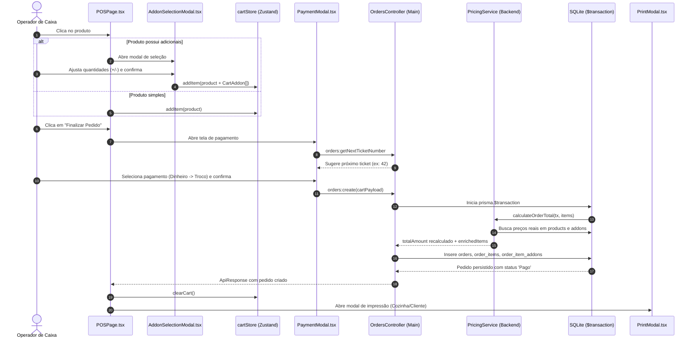

# Especificação de Domínio: Frente de Caixa (POS) e Pedidos

**Status**: Aprovado  
**Versão**: 2.0.0  
**Contexto**: Fluxo de Venda, Carrinho, Motor de Precificação, Pagamentos e Histórico  

---

## 1. Visão Geral do Domínio

O domínio de **Frente de Caixa (POS)** gerencia o ciclo de vida da venda: desde a navegação visual no cardápio e customização de adicionais, passando pelo carrinho reativo e recálculo financeiro seguro no backend, até a persistência atômica do pedido e controle do histórico de transações.



---

## 2. Máquina de Estados do Carrinho (`cartStore`)

O estado global do carrinho reside na memória do Renderer através do Zustand:

```typescript
export interface CartAddon {
  addonId: string;
  name: string;
  price: number;     // Preço unitário no momento da seleção
  quantity: number;  // Quantidade selecionada pelo operador
}

export interface CartItem {
  id: string;        // UUID único para este item no carrinho
  productId: string;
  name: string;
  basePrice: number;
  quantity: number;
  addons: CartAddon[];
  totalPrice: number; // (basePrice + sum(addon.price * addon.quantity)) * quantity
}
```

### 2.1. Regras do Carrinho
- **Adição de Item Simples**: Incrementa a quantidade ou adiciona nova linha.
- **Adição com Complementos**: Cada combinação de produto com adicionais recebe um UUID único na coleção `items`, permitindo itens com composições distintas no mesmo carrinho.
- **Recálculo Instantâneo**: A mutação de `quantity` recalcula o total da linha e o `cartTotal` global em tempo real.

---

## 3. Seleção de Adicionais com Múltiplas Quantidades

No `AddonSelectionModal`, o operador pode atribuir quantidades numéricas individuais a cada adicional (ex.: 2 coberturas de morango e 1 de chocolate).

### 3.1. Regras de Validação em Tempo Real
- **Limite Máximo por Grupo**: $\sum (\text{quantidade de adicionais}) \le \text{max\_selections}$. O botão `+` de todos os adicionais daquele grupo é desativado quando o limite é atingido.
- **Obrigatoriedade / Mínimo**: $\sum (\text{quantidade de adicionais}) \ge \text{min\_selections}$. O botão "Adicionar ao Pedido" permanece desabilitado enquanto qualquer grupo com `min_selections > 0` não for satisfeito.
- **Feedback Visual**: Cada grupo exibe um badge contextual com a contagem atual (ex.: `2 / 3`).

---

## 4. Motor de Precificação no Backend (`PricingService`)

Para evitar fraudes ou discrepâncias causadas por dados defasados na memória do frontend, o cálculo financeiro final é **exclusividade do backend**.

```typescript
// Executado estritamente dentro da transação do banco de dados
export const PricingService = {
  async calculateOrderTotal(tx: PrismaTransactionClient, items: CartItemPayload[]) {
    let totalAmount = 0;
    const enrichedItems = [];

    for (const item of items) {
      // 1. Busca o preço oficial atual do produto no banco
      const product = await tx.products.findUniqueOrThrow({ where: { id: item.productId } });
      const basePrice = Number(product.base_price);
      
      let itemAddonsTotal = 0;
      const enrichedAddons = [];

      for (const addon of item.addons) {
        // 2. Busca o preço oficial atual do adicional no banco
        const dbAddon = await tx.addons.findUniqueOrThrow({ where: { id: addon.addonId } });
        const chargedPrice = Number(dbAddon.price);
        
        itemAddonsTotal += chargedPrice * addon.quantity;
        enrichedAddons.push({
          addon_id: addon.addonId,
          quantity: addon.quantity,
          charged_price: chargedPrice
        });
      }

      const itemTotal = (basePrice + itemAddonsTotal) * item.quantity;
      totalAmount += itemTotal;

      enrichedItems.push({
        product_id: item.productId,
        quantity: item.quantity,
        unit_price: basePrice,
        addons: enrichedAddons
      });
    }

    return { totalAmount, enrichedItems };
  }
};
```

---

## 5. Fluxo de Pagamento e Troco em Dinheiro

No modal de pagamento (`PaymentModal`), o operador seleciona a forma de quitação e confirma a senha de atendimento.

### 5.1. Senha de Atendimento Diária (`ticket_number`)
- O sistema consulta `orders:getNextTicketNumber`, buscando o maior ticket emitido entre `00:00:00` e `23:59:59` da data corrente e incrementando em 1 (reinicia diariamente em 1).
- O operador pode sobrescrever o valor manualmente caso utilize cartões de senha física pré-impressos.

### 5.2. Formas de Pagamento Homologadas
- **Dinheiro**: Dispara a etapa 2 (*Calcular Troco*), solicitando o valor entregue pelo cliente (`amountReceived`).
  - Regra de bloqueio: `amountReceived` $\ge$ `cartTotal`.
  - Persiste: `amount_paid` e `change_amount = amountReceived - cartTotal`.
- **Cartão de Crédito**
- **Cartão de Débito**
- **PIX**

---

## 6. Histórico e Cancelamento de Pedidos

A tela de histórico (`OrderHistoryList`) permite auditoria completa das vendas emitidas.

### 6.1. Filtros de Pesquisa
- **Período**:
  - `Hoje`: Vendas de `00:00:00` até `23:59:59` do dia local.
  - `Todos`: Histórico acumulado global.
  - `Personalizado`: Filtro por faixa de datas (`dateFrom` até `dateTo`).
- **Status**: Todos, Pago ou Cancelado.
- **Senha**: Busca exata pelo número do ticket.

### 6.2. Cancelamento Auditado
- O cancelamento exige obrigatoriamente uma justificativa textual (`cancel_reason`).
- Pedidos cancelados **não são excluídos fisicamente do banco de dados**, preservando o histórico de auditoria.
- Os relatórios e dashboards excluem pedidos com status `'Cancelado'` do faturamento líquido.

### 6.3. Reimpressão de Comprovantes
A partir do modal de detalhes do pedido (`OrderDetailsModal`), é possível reimprimir tanto a comanda de Cozinha quanto o comprovante de Cliente a qualquer momento.

---

## 7. Especificação dos Canais IPC

| Canal IPC | Parâmetros | Retorno (`ApiResponse<T>`) | Descrição |
|---|---|---|---|
| `orders:getNextTicketNumber` | — | `number` | Retorna próxima senha do dia |
| `orders:create` | `cartPayload: OrderPayload` | `Order` | Cria pedido completo em transação |
| `orders:getAll` | `filters?: { dateFrom, dateTo, ticket_number, status }` | `Order[]` | Lista histórico ordenado por data desc |
| `orders:getById` | `id: string` | `Order` (com itens, adicionais e produto) | Detalhes completos do pedido |
| `orders:cancel` | `id: string, justification: string` | `Order` | Cancela pedido registrando justificativa |
