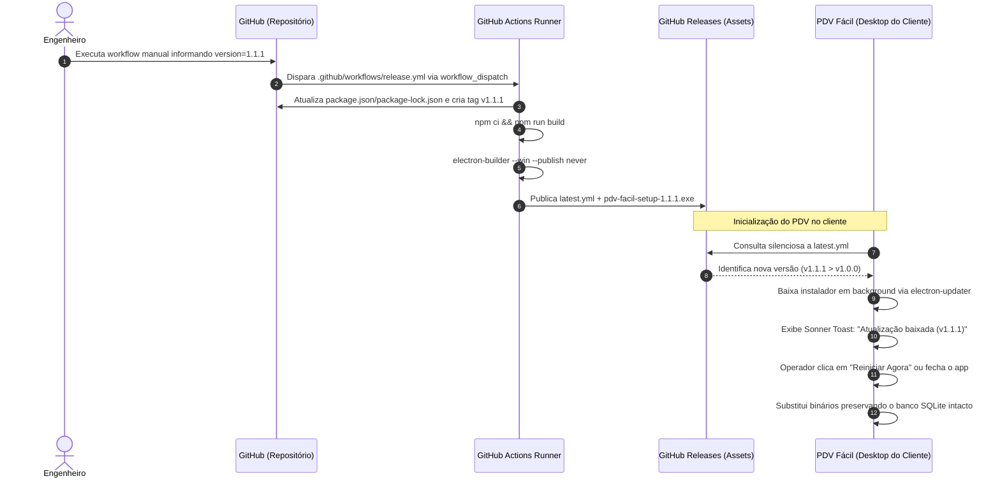

# Especificação Operacional: Versionamento, CI/CD e Auto-Update

**Status**: Aprovado  
**Versão**: 2.0.0  
**Contexto**: Git Flow, Pipeline GitHub Actions, Empacotamento Electron-Builder e Atualização Contínua  

---

## 1. Visão Geral

Esta especificação formaliza o ciclo de vida de lançamentos do **PDV Fácil**, detalhando o fluxo de ramificações (*branching*), automação de compilação em nuvem, geração de instaladores para Windows e a mecânica de atualização automática em segundo plano sem perda de dados locais.



---

## 2. Padrão de Branching e Versionamento (SemVer)

O projeto adota o **Semantic Versioning (SemVer 2.0.0)** (`MAJOR.MINOR.PATCH`):
- **MAJOR**: Alterações arquiteturais drásticas com quebra de compatibilidade ou reformulação de banco de dados estrutural.
- **MINOR**: Novas funcionalidades de negócio retrocompatíveis com o banco de dados.
- **PATCH**: Correções de defeitos ou falhas de estabilidade sem adição de features.

### 2.1. Estrutura de Branches
- **`main`**: Código apto para produção. Quando uma versão deve ser distribuída, o workflow manual cria um commit de versionamento em `main`, uma tag git correspondente (ex: `v1.2.0`) e uma GitHub Release.
- **`develop`**: Ramificação de integração contínua para próximas releases.
- **`feature/*`**: Ramificações isoladas para novas tarefas, integradas à `develop` via Pull Request.
- **`hotfix/*`**: Correções emergenciais que partem da `main` e são reintegradas simultaneamente na `main` e na `develop`.

---

## 3. Automação CI/CD no GitHub Actions

O workflow `.github/workflows/release.yml` garante reprodutibilidade total das compilações de distribuição e é executado manualmente pelo GitHub Actions, recebendo a versão SemVer desejada como input.

```yaml
name: Build & Release

on:
  workflow_dispatch:
    inputs:
      version:
        description: 'SemVer version to release, without the v prefix (example: 1.1.1)'
        required: true
        type: string
      release_notes:
        description: 'Optional release notes'
        required: false
        type: string

concurrency:
  group: release-main
  cancel-in-progress: true

jobs:
  build-and-release:
    runs-on: windows-latest
    permissions:
      contents: write

    steps:
      - name: Checkout code
        uses: actions/checkout@v5

      - name: Setup Node.js
        uses: actions/setup-node@v5
        with:
          node-version: 20
          cache: 'npm'

      - name: Install dependencies
        run: npm ci

      - name: Update package version
        run: npm version ${{ inputs.version }} --no-git-tag-version

      - name: Commit and tag release
        run: |
          git add package.json package-lock.json
          git commit -m "chore(release): v${{ inputs.version }}"
          git tag "v${{ inputs.version }}"
          git push origin main
          git push origin "v${{ inputs.version }}"

      - name: Build production (Vite + TypeScript)
        run: npm run build

      - name: Package Windows installer
        run: npx electron-builder --win --publish never

      - name: Create GitHub Release
        env:
          GH_TOKEN: ${{ secrets.GITHUB_TOKEN }}
        run: gh release create "v${{ inputs.version }}" build-release/*.exe build-release/*.blockmap build-release/latest.yml
```

### 3.1. Operação do Release Manual
1. O operador acessa **Actions → Build & Release → Run workflow** no GitHub.
2. Informa `version` sem prefixo `v` (ex.: `1.1.1`) e, opcionalmente, `release_notes`.
3. O workflow valida que a tag `v<version>` ainda não existe.
4. O próprio workflow atualiza `package.json` e `package-lock.json` com `npm version --no-git-tag-version`, commita essa alteração em `main`, cria a tag e envia ambos para o GitHub.
5. O instalador Windows é gerado e anexado à GitHub Release junto com o `.blockmap` e o `latest.yml`.
6. O download manual deve ser feito pela página da Release criada; o auto-update usa o `latest.yml` publicado nessa mesma Release.

---

## 4. Configuração do Empacotador (`electron-builder`)

Configurado no `package.json` para gerar instaladores otimizados para estações de trabalho:

### 4.0. Nome dos Artefatos
- **`artifactName: "pdv-facil-setup-${version}.${ext}"`**: força nomes ASCII previsíveis para o instalador, o `.blockmap` e o caminho referenciado por `latest.yml`, evitando divergência entre o arquivo anexado à Release e o manifesto consumido pelo `electron-updater`.

### 4.1. Instalador NSIS (Windows)
- **`oneClick: true`**: Instalação sem assistentes complexos, agilizando o setup em terminais de ponto de venda.
- **`allowToChangeInstallationDirectory: false`**: Padroniza o caminho de instalação do executável em `%LOCALAPPDATA%\Programs\pdv-facil`.
- **`deleteAppDataOnUninstall: false`**: **Crítico!** Impede a destruição do arquivo de banco de dados `pdv_database.sqlite` e das imagens em caso de desinstalação ou atualização de versão do software.

### 4.2. Desempacotamento de Binários Nativos (`asarUnpack`)
Módulos que compilam código em C++ e binários executáveis não podem residir empacotados dentro do arquivo virtual `.asar`:
- `**/*.node`
- `prisma/client/**/*`
- `node_modules/@prisma/engines/**/*`
- `node_modules/sharp/**/*`
- `node_modules/@img/**/*`

---

## 5. Ciclo de Atualização Automática (*Auto-Update*)

A atualização do software é gerenciada pelo `UpdaterService` (`src/main/services/UpdaterService.ts`) através da biblioteca `electron-updater`.

### 5.1. Inicialização e Verificação
1. Durante a inicialização da janela principal (`createWindow()`), se a aplicação estiver empacotada (`app.isPackaged`), o serviço executa:
   ```typescript
   autoUpdater.checkForUpdatesAndNotify();
   ```
2. O sistema compara a versão local do aplicativo contra o manifesto `latest.yml` publicado na última GitHub Release do repositório configurado (`petrocini/pdv-facil`).

### 5.2. Notificação e Aplicação da Atualização
1. Ao concluir o download em segundo plano, o Main Process emite o evento `updater:downloaded` para a janela do Renderer.
2. O componente raiz `App.tsx` escuta o evento e dispara uma notificação interativa persistente (`toast` da biblioteca Sonner):
   - **Mensagem**: *"Atualização baixada (v1.1.0)"*.
   - **Ação**: Botão *"Reiniciar Agora"*.
3. Se o operador clicar no botão, o método IPC `updater:quitAndInstall` é acionado; se ignorar, a atualização será aplicada silenciosamente assim que o operador fechar o aplicativo no fim do expediente.

---

## 6. Canais IPC do Módulo de Atualização

| Canal IPC | Parâmetros | Retorno | Descrição |
|---|---|---|---|
| `updater:quitAndInstall` | — | `void` | Encerra o app e dispara o instalador da nova versão |
| `updater:onDownloaded` | `callback(info)` | `void` | Registra listener para download concluído |
| `app:getVersion` | — | `string` | Retorna a versão SemVer atual do aplicativo |
