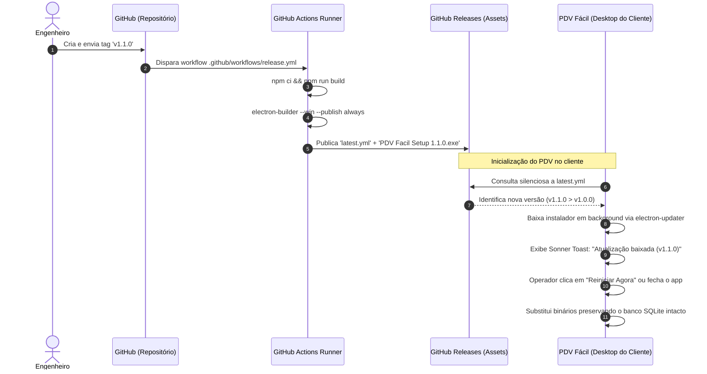

# Especificação Operacional: Versionamento, CI/CD e Auto-Update

**Status**: Aprovado  
**Versão**: 2.0.0  
**Contexto**: Git Flow, Pipeline GitHub Actions, Empacotamento Electron-Builder e Atualização Contínua  

---

## 1. Visão Geral

Esta especificação formaliza o ciclo de vida de lançamentos do **PDV Fácil**, detalhando o fluxo de ramificações (*branching*), automação de compilação em nuvem, geração de instaladores para Windows e a mecânica de atualização automática em segundo plano sem perda de dados locais.



---

## 2. Padrão de Branching e Versionamento (SemVer)

O projeto adota o **Semantic Versioning (SemVer 2.0.0)** (`MAJOR.MINOR.PATCH`):
- **MAJOR**: Alterações arquiteturais drásticas com quebra de compatibilidade ou reformulação de banco de dados estrutural.
- **MINOR**: Novas funcionalidades de negócio retrocompatíveis com o banco de dados.
- **PATCH**: Correções de defeitos ou falhas de estabilidade sem adição de features.

### 2.1. Estrutura de Branches
- **`main`**: Código em produção. Cada commit na `main` corresponde estritamente a uma versão empacotada acompanhada de tag git (ex: `v1.2.0`).
- **`develop`**: Ramificação de integração contínua para próximas releases.
- **`feature/*`**: Ramificações isoladas para novas tarefas, integradas à `develop` via Pull Request.
- **`hotfix/*`**: Correções emergenciais que partem da `main` e são reintegradas simultaneamente na `main` e na `develop`.

---

## 3. Automação CI/CD no GitHub Actions

O workflow `.github/workflows/release.yml` garante reprodutibilidade total das compilações de distribuição:

```yaml
name: Build & Release

on:
  push:
    tags:
      - 'v*'

concurrency:
  group: release-${{ github.ref }}
  cancel-in-progress: true

jobs:
  build-and-release:
    runs-on: windows-latest
    permissions:
      contents: write

    steps:
      - name: Checkout code
        uses: actions/checkout@v4

      - name: Setup Node.js
        uses: actions/setup-node@v4
        with:
          node-version: 20
          cache: 'npm'

      - name: Install dependencies
        run: npm ci

      - name: Build production (Vite + TypeScript)
        run: npm run build

      - name: Package & Publish GitHub Release
        env:
          GH_TOKEN: ${{ secrets.GITHUB_TOKEN }}
        run: npx electron-builder --win --publish always
```

---

## 4. Configuração do Empacotador (`electron-builder`)

Configurado no `package.json` para gerar instaladores otimizados para estações de trabalho:

### 4.1. Instalador NSIS (Windows)
- **`oneClick: true`**: Instalação sem assistentes complexos, agilizando o setup em terminais de ponto de venda.
- **`allowToChangeInstallationDirectory: false`**: Padroniza o caminho de instalação do executável em `%LOCALAPPDATA%\Programs\pdv-facil`.
- **`deleteAppDataOnUninstall: false`**: **Crítico!** Impede a destruição do arquivo de banco de dados `pdv_database.sqlite` e das imagens em caso de desinstalação ou atualização de versão do software.

### 4.2. Desempacotamento de Binários Nativos (`asarUnpack`)
Módulos que compilam código em C++ e binários executáveis não podem residir empacotados dentro do arquivo virtual `.asar`:
- `**/*.node`
- `prisma/client/**/*`
- `node_modules/@prisma/engines/**/*`
- `node_modules/sharp/**/*`
- `node_modules/@img/**/*`

---

## 5. Ciclo de Atualização Automática (*Auto-Update*)

A atualização do software é gerenciada pelo `UpdaterService` (`src/main/services/UpdaterService.ts`) através da biblioteca `electron-updater`.

### 5.1. Inicialização e Verificação
1. Durante a inicialização da janela principal (`createWindow()`), se a aplicação estiver empacotada (`app.isPackaged`), o serviço executa:
   ```typescript
   autoUpdater.checkForUpdatesAndNotify();
   ```
2. O sistema compara a versão local do `package.json` contra o manifesto `latest.yml` hospedado no repositório GitHub configurado (`petrocini/pdv-facil`).

### 5.2. Notificação e Aplicação da Atualização
1. Ao concluir o download em segundo plano, o Main Process emite o evento `updater:downloaded` para a janela do Renderer.
2. O componente raiz `App.tsx` escuta o evento e dispara uma notificação interativa persistente (`toast` da biblioteca Sonner):
   - **Mensagem**: *"Atualização baixada (v1.1.0)"*.
   - **Ação**: Botão *"Reiniciar Agora"*.
3. Se o operador clicar no botão, o método IPC `updater:quitAndInstall` é acionado; se ignorar, a atualização será aplicada silenciosamente assim que o operador fechar o aplicativo no fim do expediente.

---

## 6. Canais IPC do Módulo de Atualização

| Canal IPC | Parâmetros | Retorno | Descrição |
|---|---|---|---|
| `updater:quitAndInstall` | — | `void` | Encerra o app e dispara o instalador da nova versão |
| `updater:onDownloaded` | `callback(info)` | `void` | Registra listener para download concluído |
| `app:getVersion` | — | `string` | Retorna a versão SemVer atual do aplicativo |
