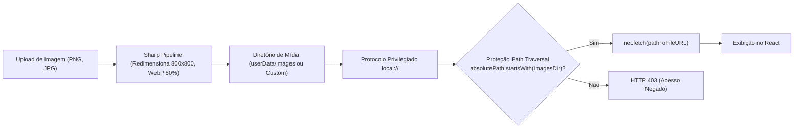

# Especificação Operacional: Configurações, Mídia e Protocolo Privilegiado

**Status**: Aprovado  
**Versão**: 2.0.0  
**Contexto**: Personalização do Estabelecimento, Pipeline de Imagens Sharp e Protocolo Seguro `local://`  

---

## 1. Visão Geral

Esta especificação define como os parâmetros globais da empresa são gerenciados e como o sistema processa, otimiza e serve arquivos de imagem locais sem abrir brechas de segurança de I/O no processo Renderer.



---

## 2. Parâmetros Globais do Sistema (`settings`)

As configurações da empresa seguem o padrão **Singleton** (existe apenas um registro ativo na tabela `settings`).

### 2.1. Atributos Configurados
- `company_name`: Razão Social ou Nome Fantasia impresso no topo do cupom do cliente.
- `company_document`: CNPJ ou CPF do estabelecimento, manipulado na UI com máscara formatada via componente `DocumentInput`.
- `logo_path`: Nome do arquivo WebP da logomarca da empresa.
- `images_directory`: Diretório físico absoluto opcional selecionado pelo operador. Se nulo ou vazio, o sistema adota automaticamente o diretório padrão `app.getPath('userData')/images`.
- `printer_name`: Nome exato do dispositivo de impressão térmica térmica selecionado na lista de impressoras do sistema operacional.

---

## 3. Pipeline de Processamento de Imagens (`ImageController` + `Sharp`)

O processamento e compressão ocorrem no Main Process para evitar sobrecarga no Renderer e manter imagens padronizadas em disco:

```typescript
// Pipeline de upload em ImageController.ts
const filename = `${uuidv4()}.webp`;
const destinationPath = path.join(imagesDir, filename);

await sharp(originalFilePath)
  .resize(800, 800, {
    fit: 'inside',
    withoutEnlargement: true
  })
  .webp({ quality: 80 })
  .toFile(destinationPath);
```

### 3.1. Vantagens do Padrão
- **Formato Único**: 100% dos arquivos de mídia são convertidos para `WebP`.
- **Economia de Armazenamento**: Imagens fotográficas de alta resolução (4MB a 10MB) são compactadas para médias entre 40KB e 120KB.
- **Dimensão Máxima de 800×800px**: Garante carregamento instantâneo em telas touch e listas do catálogo sem degradação visual.

---

## 4. Implementação Segura do Esquema Privilegiado `local://`

O Electron restringe o acesso direto ao protocolo `file://` por questões de segurança. Para servir as imagens locais com alta performance, o PDV Fácil registra um esquema customizado e privilegiado.

### 4.1. Registro Privilegiado (Antes do `app.ready`)
```typescript
protocol.registerSchemesAsPrivileged([
  {
    scheme: 'local',
    privileges: {
      standard: true,
      secure: true,
      supportFetchAPI: true
    }
  }
]);
```

### 4.2. Mitigação Rigorosa contra Path Traversal
Um ataque clássico de manipulação de URLs consiste em tentar acessar diretórios sensíveis do sistema via relativização de caminhos (ex: `local://../../Windows/System32/config/SAM`). O protocolo implementa contenção determinística:

```typescript
protocol.handle('local', async (request) => {
  const parsed = new URL(request.url);
  const filename = decodeURIComponent(parsed.hostname || parsed.pathname.replace(/^\/+/, ''));

  const imagesDir = settings?.images_directory || path.join(app.getPath('userData'), 'images');
  const absolutePath = path.normalize(path.join(imagesDir, filename));

  // Validação: o caminho normalizado DEVE obrigatoriamente iniciar com imagesDir
  if (!absolutePath.startsWith(path.normalize(imagesDir))) {
    return new Response('Acesso Negado (Path Traversal Detection)', { status: 403 });
  }

  return net.fetch(pathToFileURL(absolutePath).toString());
});
```

---

## 5. Especificação dos Canais IPC

| Canal IPC | Parâmetros | Retorno (`ApiResponse<T>`) | Descrição |
|---|---|---|---|
| `settings:get` | — | `Settings` | Obtém o registro singleton de configurações |
| `settings:upsert` | `data: Partial<Settings>` | `Settings` | Cria ou atualiza as configurações do sistema |
| `dialog:selectDirectory` | — | `string` (caminho absoluto) | Abre o explorador de arquivos nativo do SO |
| `image:upload` | `filePath: string` | `string` (nome do arquivo `.webp`) | Otimiza a imagem via Sharp e salva no disco |
